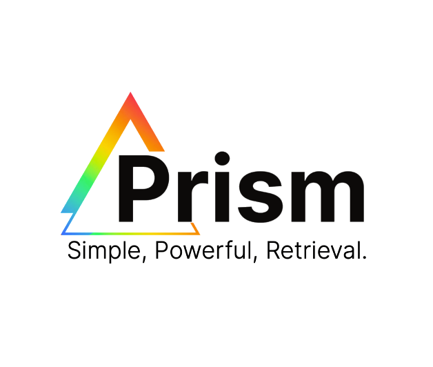

<!-- Improved compatibility of back to top link -->
<a name="readme-top"></a>

<!-- PROJECT SHIELDS -->

[![Contributors][contributors-shield]][contributors-url]
[![Forks][forks-shield]][forks-url]
[![Stargazers][stars-shield]][stars-url]
[![Issues][issues-shield]][issues-url]
[![MIT License][license-shield]][license-url]
[![LinkedIn][linkedin-shield]][linkedin-url]


<!-- PROJECT LOGO -->
<br />
<div align="center">
  <a href="https://github.com/Renaissance-Studio/Prism-AI">
    
  </a>

<h3 align="center">project_title</h3>

  <p align="center">
    project_description
    <br />
    <a href="https://github.com/Renaissance-Studio/Prism-AI"><strong>Explore the docs »</strong></a>
    <br />
    <br />
    <a href="https://github.com/Renaissance-Studio/Prism-AI">View Demo</a>
    ·
    <a href="https://github.com/Renaissance-Studio/Prism-AI/issues">Report Bug</a>
    ·
    <a href="https://github.com/Renaissance-Studio/Prism-AI/issues">Request Feature</a>
  </p>
</div>


<!-- TABLE OF CONTENTS -->
<details>
  <summary>Table of Contents</summary>
  <ol>
    <li>
      <a href="#about-the-project">About The Project</a>
      <ul>
        <li><a href="#built-with">Built With</a></li>
      </ul>
    </li>
    <li>
      <a href="#getting-started">Getting Started</a>
      <ul>
        <li><a href="#prerequisites">Prerequisites</a></li>
        <li><a href="#installation">Installation</a></li>
      </ul>
    </li>
    <li><a href="#usage">Usage</a></li>
    <li><a href="#roadmap">Roadmap</a></li>
    <li><a href="#contributing">Contributing</a></li>
    <li><a href="#license">License</a></li>
    <li><a href="#contact">Contact</a></li>
    <li><a href="#acknowledgments">Acknowledgments</a></li>
  </ol>
</details>


<!-- ABOUT THE PROJECT -->
## About The Project

[![Product Name Screen Shot][product-screenshot]](https://example.com)

Here's a blank template to get started: To avoid retyping too much info. Do a search and replace with your text editor for the following: `github_username`, `repo_name`, `twitter_handle`, `linkedin_username`, `email_client`, `email`, `project_title`, `project_description`

<p align="right">(<a href="#readme-top">back to top</a>)</p>


### Built With

* [![Next][Next.js]][Next-url]
* [![React][React.js]][React-url]
* [![Vue][Vue.js]][Vue-url]
* [![Angular][Angular.io]][Angular-url]
* [![Svelte][Svelte.dev]][Svelte-url]
* [![Laravel][Laravel.com]][Laravel-url]
* [![Bootstrap][Bootstrap.com]][Bootstrap-url]
* [![JQuery][JQuery.com]][JQuery-url]

<p align="right">(<a href="#readme-top">back to top</a>)</p>


<!-- GETTING STARTED -->
## Getting Started

### Prerequisites

You'll need python version 3.7 or higher to use the Prism AI API wrapper.

### Installation

1. Get a free API Key at [https://www.prism-ai.ch/](https://www.prism-ai.ch/)
2. Install Prism-AI package 
   ```sh
   pip install prism_ai
   ```
4. Enter your API as an environment variable, OR specify within python itself
   ```sh
   export PRISM_API_KEY="rs_123...456"
   ```
   OR
   ```py
   import prism_ai as pai
   pai.api_key = "rs_123...456"
   ```
5. Start Building! 

<p align="right">(<a href="#readme-top">back to top</a>)</p>


<!-- USAGE EXAMPLES -->
## Usage

### Knowledge

A "Knowledge" object is a bunch of text which you can let your AI model reference. You can feed text data to a knowledge object either via: 

 1. Specifying a URL that Prism will crawl for text data, (i.e.):

    ```py
    knowledge = pai.Knowledge.create(
      method = "url", # The knowledge extraction method
      name = "prism knowledge", # A name for your knowledge object 
      kb_id = 1, # The knowledge base id which this knowledge should belong to 
      url = "https://www.prism-ai.ch/", # The url to scrape (NOTE: only https will work. http urls will be rejected.)
    )
    ```

  Similarly, you can crawl a url recursively to extract and crawl all links, sublinks, and sub-sublinks etc... found on a webpage, up to the maximum recursion level (automatically capped at 100)
  
    ```py
    knowledge = pai.Knowledge.create(
        method = "url",
        name = "prism knowledge",
        kb_id = 1,
        url = "https://www.prism-ai.ch/",
        recursion = True, # Set to False by default
        max_recursion = 50, # Number of linked pages to also scrape
        only_base_url = False # Specifies whether or not to accept linked urls outside the provided domain network location
      )
    ```

 2. Specifying a Path to a file or directory where Prism will extract text data, 

    ```py
      knowledge = pai.Knowledge.create(
        method = "path",
        name = "prism knowledge",
        kb_id = 1,
        text = "/home/prism_user/Desktop/useful_knowledge.pdf" 
      )
    ```

 3. Specifying a string to be added directly to the knowledge

    ```py
      knowledge = pai.Knowledge.create(
        method = "text",
        name = "prism knowledge",
        kb_id = 1,
        url = "Peter Piper picked a peck of pickled peppers." 
      )
    ```
    
 4. Plug in directly to your Google Drive, One Drive, Sharepoint, Nextcloud, ... (Coming Soon!)

Note that specifying knowledge via Raw Text is the most customizable method by which to add knowledge to a Knowledge Base, however requires the most customization from the client. Alternatively, you can use our built in web-scrapers (point 2 above) to scrape text data from hundreds of websites siumltaneously and immediately use the resulting data in your R.A.G. pipeline. 

### Knowledge Bases 

Knowledge bases provide the organizational structure of your textual information. You can create a knowledge base like this: 

```
pai.KnowledgeBase.create(
  name="The name of your KnowledgeBase"
)
```

You can additionally add knowledges directly to a knowledge base by specifying them within the knowledge creation call: 

```py
kb = pai.KnowledgeBase.create(
        knowledges = ["https://www.narwhal.ch/about", "https://www.gwcustom.com/about/"],
        names = ["test1", "test2"],
        name = "Test knowledge base"
        )

```

### Reply

Prism will directly forward your context to OpenAI (or your LLM provider of choice) using the Reply function: 

```py
reply = pai.Reply.create(
  prompt = "Tell me something Interesting that about prism-ai.",
  knowledge_base = []
)
```

Having been provided the relevant information from our homepage, the model is able to successfully answer questions about prism! 

You can also stream your response: 

```py
reply = pai.Reply.stream(
  prompt = "What is the only pair of twin primes whose difference is just 1?",
  knowledge_bases = [2,3]
)
```

_For more examples, please refer to the [Documentation](https://www.prism-ai.ch/)_

<p align="right">(<a href="#readme-top">back to top</a>)</p>


## Introduction to Prism

**Prism** is an innovative platform designed to simplify the integration of Retrieval Augmented Generation (RAG) capabilities into your applications. RAG combines the power of large language models with the ability to retrieve and incorporate information from knowledge sources seamlessly. It enhances the text generated by AI models, such as ChatGPT, Bard or Claude, by incorporating real-world knowledge.

**RAG** is a groundbreaking approach in the field of AI that allows developers to tap into the vast knowledge available in databases, websites, and files. By integrating this knowledge, developers can create AI systems that provide accurate and contextually relevant information. RAG is particularly valuable in tasks such as document search, question-answering, and chatbots, where understanding context and retrieving relevant information are crucial.

**Vector embeddings**, a key component of RAG systems, play a crucial role in capturing the semantic meaning of words and phrases. These embeddings transform text into high-dimensional numerical representations, enabling AI models to compare and identify similar information effectively. Vector embeddings have been instrumental in advancing RAG systems by providing a nuanced understanding of information and improving search capabilities.

**Vector Embeddings are not Enough!** Prism takes RAG to the next level by offering powerful **Multidimensional Index Structures**, **Named Entity Recognition** and subsequent **Knowledge-Graph Retrieval**, and more. Through Prism's intuitive API and libraries available in multiple languages, including Python and JavaScript, developers can quickly integrate RAG capabilities into their applications. Whether you are an expert or just getting started with language models, Prism's user-friendly platform simplifies the process of incorporating real-world knowledge into your AI applications.

## Installation and Setup

Prism is ready to go out of the box. The only major steps for setup are: 

### Install Prism with pip 

```sh
pip install prism_ai
```
### Get an API Key 

You can generate an API key by creating an account [here](https://www.prism-ai.ch/) and adding an API key directly in the application. Make sure to store it somewhere, you'll never see it again after it's created. 

### Add your API key as an environment variable 

```sh 
export PRISM_API_KEY=rs_123...def
```

Or to set your API key directly in python you can run: 

```py
import prism_ai as pai
pai.api_key = "rs_123...def"
```

## Standalone Methods 

### Info

```py
pai.info()
```

#### Summary 

Assuming the API key has been specified and you have a stable connection to the internet, the info function will return a breakdown of the user info, as well as the knowledge-graph tree containing a list of all knowledge bases, and a list of all contained knowledges for each knowledge base. 

This function has no required or optional parameters.

## Resource Methods

### Knowledge Bases

#### Create 

**Summary:**

Knowledge bases provide the organizational structure of your textual information. Knowledge Bases contain individual Knowledges. This function is used to create a knowledge base. 

**Required Parameters:**

*name: str* - This is the name you will assign to your knowledge base.  

**Optional Parameters:**

*base_dir: str (default: None)* - A path to a directory, where Prism should read files from. Every file from this directory will be processed as individual knowledges, to be added to the new knowledge base.

*base_url: str (default: None)* - A url from which Prism should extract relevant context. Only one of base_dir or base_url can be supplied. If both are supplied to the create function, an error will be thrown. 

*recursion: bool (default: False)* - Specifies whether knowledge should be added recursively 

*max_recursion: int (default: None)* - Specifies the maximum number of files to read from a directory, or urls to scrape from links in the provided base_url.

*only_base_url: bool (default: True)* - Specifies whether or not to scrape urls from links which point to network locations, other than the one supplied. For example, if only_base_url is set to True, and base_url is set to "https://www.prism-ai.ch/about/", then Prism will only create context from the urls it finds which also point to a network location belonging to prism-ai.ch. This argument will be ignored if used in combination with the base_dir argument. 

*kb_meta_context: str (default: None)* - This string will be supplied to prompts with the context retrieved from this Knowledge Base, any time context is retrieved from this Knowledge Base. Adding relevant meta context, in general, significantly improves an LLM's ability to utilize context and synthesize information which is provided to it. 

*smart_index: bool (default: False)* - Specify whether or not to apply Prism's "Smart Index" to the resulting context data. In general, you should keep this option set to False unless you anticipate adding a large amount of information to this knowledge base. You can read more about Prism's Smart Index [here](https://www.prism-ai.ch/).

*ner: bool (default: False)* - Specify whether or not to extract named entities from provided text for use in Prism's knowledge graph retrieval engine. 

**Example Usage:**

Create a Knowledge Base from information found on the internet: 

```py
kb = pai.KnowledgeBase.create(
  name = "Online Prism Information", 
  base_url = "https://www.prism-ai.ch/",
  only_base_url = True, 
  recursion = True, 
  max_recursion = 100, 
  kb_meta_context = "This is information which was extracted from Prism's website",
  generate_meta_context = True,
  smart_index = False, 
  ner = True 
)
```

Create a Knowledge Base from information found on a local filesystem: 

```py
kb = pai.KnowledgeBase.cretae(
  name = "Local Prism Information", 
  base_dir = "/path/to/relevant/directory",
  recursion = True, 
  kb_meta_context = "This is information which was extracted from local files belonging to Prism's team.",
  generate_meta_context = True,
  smart_index = False, 
  ner = True
)
```

**Important Note:** embedding, entity extraction, graph generation, and context organization takes some time, and happens asynchronously with your calls to the API. This means that you will recieve a response from create or add calls to both Knowledge and Knowledge Base objects before they are ready and available to be used for RAG. You can see the availability of your knowledge object at any time by running: 

```py
print(pai.Knowledge.get(knowledge_id=int(your_knowledge_id)))
```

Or alternatively you can retrieve the status of all your knowledge objects by running: 

```py
pai.info()
```

#### Add 

**Summary:**

Knowledge bases provide the organizational structure of your textual information. Knowledge Bases contain individual Knowledges. This function is used to add to an existing knowledge base. 

**Required Parameters:**

*kb_id: int* - This is the ID of the knowledge base you wish to add knowledge to.

**Optional Parameters:**

*base_dir: str (default: None)* - A path to a directory, where Prism should read files from. Every file from this directory will be processed as individual knowledges, to be added to the new knowledge base.

*base_url: str (default: None)* - A url from which Prism should extract relevant context. Only one of base_dir or base_url can be supplied. If both are supplied to the create function, an error will be thrown. 

*recursion: bool (default: False)* - Specifies whether knowledge should be added recursively 

*max_recursion: int (default: None)* - Specifies the maximum number of files to read from a directory, or urls to scrape from links in the provided base_url.

*only_base_url: bool (default: True)* - Specifies whether or not to scrape urls from links which point to network locations, other than the one supplied. For example, if only_base_url is set to True, and base_url is set to "https://www.prism-ai.ch/about/", then Prism will only create context from the urls it finds which also point to a network location belonging to prism-ai.ch. This argument will be ignored if used in combination with the base_dir argument. 

*kb_meta_context: str (default: None)* - This string will be supplied to prompts with the context retrieved from this Knowledge Base, any time context is retrieved from this Knowledge Base. Adding relevant meta context, in general, significantly improves an LLM's ability to utilize context and synthesize information which is provided to it. 

*generate_meta_context: bool (default: True)* - This setting determines whether or not to dynamically generate meta-context for each knowledge which is supplied to the knowledge base. Providing both kb_meta_context, and turning on generate_meta_context has been shown to significantly improve retrieval metrics, and subsequent generations.

*smart_index: bool (default: False)* - Specify whether or not to apply Prism's "Smart Index" to the resulting context data. In general, you should keep this option set to False unless you anticipate adding a large amount of information to this knowledge base. You can read more about Prism's Smart Index [here](https://www.prism-ai.ch/).

*ner: bool (default: False)* - Specify whether or not to extract named entities from provided text for use in Prism's knowledge graph retrieval engine. 

**Example Usage:**

Add information from the internet to an existing knowledge base:

```py
kb = pai.KnowledgeBase.add(
  kb_id = 1, 
  base_url = "https://www.prism-ai.ch/",
  only_base_url = True, 
  recursion = True, 
  max_recursion = 100, 
  kb_meta_context = "This is information which was extracted from Prism's website",
  generate_meta_context = True,
  smart_index = False, 
  ner = True 
)
```

**Important Note:** embedding, entity extraction, graph generation, and context organization takes some time, and happens asynchronously with your calls to the API. This means that you will recieve a response from create or add calls to both Knowledge and Knowledge Base objects before they are ready and available to be used for RAG. You can see the availability of your knowledge object at any time by running: 

```py
print(pai.Knowledge.get(knowledge_id=int(your_knowledge_id)))
```

Or alternatively you can retrieve the status of all your knowledge objects by running: 

```py
pai.info()
```

#### Delete 

**Summary:**

This function is used to delete a knowledge base. This action is irreversable and should be used with caution. 

**Required Parameters:**

*kb_id: int* - This is the ID of the knowledge base you wish to delete.

**Optional Parameters:**

None

**Example Usage:**

```py
kb = pai.KnowledgeBase.delete(
  kb_id = 1
)
```

### Knowledge 

#### Create 

**Summary:**

Knowledges contain context for a LLM to use for improving generations. Every knowledge is contained within a single knowledge base. Knowledges can be created from a webpage, a file, a user-supplied string of text, or an audio / video file (coming soon). 

**Required Parameters:**

*method: str* - Can be one of: "url", "text" or "file", indicating whether to grab knowledge from a url, from a user-supplied string, or a file, respectively. Supported filetypes are pdf, doc, docx, txt, odt and md. URLs must be prefixed with https or they will not be indexed. 

*name: str* - The name you wish to give your knowledge. 

*kb_id: int* - The ID of the knowledge base where you wish to create this knowledge. 

*source: str* - The url, filesystem path, or user-supplied string which you wish to add to the knowledge base.

**Optional Parameters:**

*meta_context: str (default: None)* - This string will be supplied to prompts with the context retrieved from this Knowledge, any time context is retrieved from this Knowledge, in addition to the meta context attached to the parent knowledge base. Adding relevant meta context, in general, significantly improves an LLM's ability to utilize context and synthesize information which is provided to it. If meta_context is not supplied, meta_context will be automatically generated for the knowledge object in the background. 

**Example Usage:**

Creating a knowledge from a url: 

```py
knowledge = pai.Knowledge.create(
  method = "url", 
  name = "Knowledge about Prism", 
  kb_id = 1, 
  source = "https://www.prism-ai.ch/",
  meta_context = "This is information retrieved from the Prism website."
)
```

Creating a knowledge from a file: 

```py
knowledge = pai.Knowledge.create(
  method = "file", 
  name = "Knowledge about Prism", 
  kb_id = 1, 
  source = "/path/to/prism.pdf",
  meta_context = "This is information retrieved from the Prism documentation."
)
```

Creating a knowledge from a file: 

```py
knowledge = pai.Knowledge.create(
  method = "text", 
  name = "Knowledge about Prism", 
  kb_id = 1, 
  source = "Did you know that Prism supports fully private instances? That means nobody but you ever touches your data!",
  meta_context = "This is information retrieved from the Prism documentation."
)
```

**Important Note:** embedding, entity extraction, graph generation, and context organization takes some time, and happens asynchronously with your calls to the API. This means that you will recieve a response from create or add calls to both Knowledge and Knowledge Base objects before they are ready and available to be used for RAG. You can see the availability of your knowledge object at any time by running: 

```py
print(pai.Knowledge.get(knowledge_id=int(your_knowledge_id)))
```

Or alternatively you can retrieve the status of all your knowledge objects by running: 

```py
pai.info()
```

#### Delete 

**Summary:**

This function is used to delete a knowledge. This action is irreversable and should be used with caution. 

**Required Parameters:**

*knowledge_id: int* - This is the ID of the knowledge you wish to delete.

**Optional Parameters:**

None

**Example Usage:**

```py
to_delete = pai.Knowledge.delete(
  knowledge_id = 1
)
```

### Reply

**Summary:**

This endpoint allows you to forward context directly to the LLM of your choice. Using Reply objects is more powerful, and usually faster, than retrieving context and sending to an LLM yourself. This is due in part to the various prompt schemas we have tested and created meticulously to maximize performance in the backend, as well as the remaining part of our RAG pipeline which get's dropped when retrieving context directly to your own internal application. 

#### Create 

**Summary:**

This endpoint allows you to generate a reply from the LLM of your choice. 

**Required Parameters:**

*prompt: str* - This provides a prompt for the LLM from which to generate a reply. 

**Optional Parameters:**

*kb_id: List[int] (default: [])* - A list of knowledge base ids from which to retrieve relevant context. 

*model: str (coming soon)* - An LLM to use for generating a reply. In the very near future, we aim to offer every model available from OpenAI, Anthropic, Minstral, Google, Meta, and more.  

*__HyDE__: bool (default: False)* - Here you can indicate whether you would like to run the HyDE algorithm for RAG. This option is good for short prompts contianing little context to search for. 

**Example Usage:**

Create a reply using some knowledge base: 

```py
reply = pai.Reply.create(
  prompt = "Tell me something Interesting that about prism-ai.",
  knowledge_base = [1],
  HyDE = True, 
  
)
```

#### Stream 

**Summary:**

**Required Parameters:**

**Optional Parameters:**

**Example Usage:**

### Context 

#### get

**Summary:**

**Required Parameters:**

**Optional Parameters:**

**Example Usage:**


<!-- ROADMAP -->
## Roadmap

- [ ] Feature 1
- [ ] Feature 2
- [ ] Feature 3
    - [ ] Nested Feature

See the [open issues](https://github.com/Renaissance-Studio/Prism-AI/issues) for a full list of proposed features (and known issues).

<p align="right">(<a href="#readme-top">back to top</a>)</p>


<!-- CONTRIBUTING -->
## Contributing

If you have a suggestion that would make this better, please fork the repo and create a pull request. You can also simply open an issue with the tag "enhancement".
Don't forget to give the project a star! Thanks again!

1. Fork the Project
2. Create your Feature Branch (`git checkout -b feature/AmazingFeature`)
3. Commit your Changes (`git commit -m 'Add some AmazingFeature'`)
4. Push to the Branch (`git push origin feature/AmazingFeature`)
5. Open a Pull Request

<p align="right">(<a href="#readme-top">back to top</a>)</p>


<!-- LICENSE -->
## License

Distributed under the MIT License. See `LICENSE.txt` for more information.

<p align="right">(<a href="#readme-top">back to top</a>)</p>


<!-- CONTACT -->
## Contact

Prism AI - info@prism-ai.ch
<!-- [@twitter_handle](https://twitter.com/twitter_handle)-->

Project Link: [https://github.com/Renaissance-Studio/Prism-AI](https://github.com/Renaissance-Studio/Prism-AI)

<p align="right">(<a href="#readme-top">back to top</a>)</p>


<!-- ACKNOWLEDGMENTS -->
## Acknowledgments

* []()
* []()
* []()

<p align="right">(<a href="#readme-top">back to top</a>)</p>


<!-- MARKDOWN LINKS & IMAGES -->
<!-- https://www.markdownguide.org/basic-syntax/#reference-style-links -->
[contributors-shield]: https://img.shields.io/github/contributors/github_username/repo_name.svg?style=for-the-badge
[contributors-url]: https://github.com/Renaissance-Studio/Prism-AI/graphs/contributors
[forks-shield]: https://img.shields.io/github/forks/Renaissance-Studio/Prism-AI.svg?style=for-the-badge
[forks-url]: https://github.com/Renaissance-Studio/Prism-AI/network/members
[stars-shield]: https://img.shields.io/github/stars/Renaissance-Studio/Prism-AI.svg?style=for-the-badge
[stars-url]: https://github.com/Renaissance-Studio/Prism-AI/stargazers
[issues-shield]: https://img.shields.io/github/issues/Renaissance-Studio/Prism-AI.svg?style=for-the-badge
[issues-url]: https://github.com/Renaissance-Studio/Prism-AI/issues
[license-shield]: https://img.shields.io/github/license/Renaissance-Studio/Prism-AI.svg?style=for-the-badge
[license-url]: https://github.com/Renaissance-Studio/Prism-AI/blob/master/LICENSE.txt
[linkedin-shield]: https://img.shields.io/badge/-LinkedIn-black.svg?style=for-the-badge&logo=linkedin&colorB=555
[linkedin-url]: https://linkedin.com/in/linkedin_username
[product-screenshot]: images/screenshot.png
[Next.js]: https://img.shields.io/badge/next.js-000000?style=for-the-badge&logo=nextdotjs&logoColor=white
[Next-url]: https://nextjs.org/
[React.js]: https://img.shields.io/badge/React-20232A?style=for-the-badge&logo=react&logoColor=61DAFB
[React-url]: https://reactjs.org/
[Vue.js]: https://img.shields.io/badge/Vue.js-35495E?style=for-the-badge&logo=vuedotjs&logoColor=4FC08D
[Vue-url]: https://vuejs.org/
[Angular.io]: https://img.shields.io/badge/Angular-DD0031?style=for-the-badge&logo=angular&logoColor=white
[Angular-url]: https://angular.io/
[Svelte.dev]: https://img.shields.io/badge/Svelte-4A4A55?style=for-the-badge&logo=svelte&logoColor=FF3E00
[Svelte-url]: https://svelte.dev/
[Laravel.com]: https://img.shields.io/badge/Laravel-FF2D20?style=for-the-badge&logo=laravel&logoColor=white
[Laravel-url]: https://laravel.com
[Bootstrap.com]: https://img.shields.io/badge/Bootstrap-563D7C?style=for-the-badge&logo=bootstrap&logoColor=white
[Bootstrap-url]: https://getbootstrap.com
[JQuery.com]: https://img.shields.io/badge/jQuery-0769AD?style=for-the-badge&logo=jquery&logoColor=white
[JQuery-url]: https://jquery.com 
